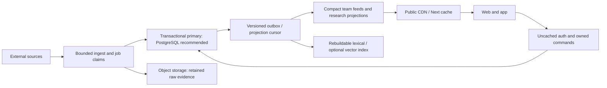

# Down & Distance: primary database architecture and D1 feasibility

Audit date: September 27, 2026. **Research and planning only.** No application code, authentication, schemas, migrations, infrastructure, configuration, schedules or production data changed. Local PostgreSQL was inspected through a host-guarded, read-only transaction; no production database was queried. Report files are the only workspace additions for this task.

The supplied attachment ends mid-sentence at “For each serious architecture determine what happens when a Free”. This report covers Free exhaustion, paid overages, consistency, recovery and migration failure modes under that heading.

## Decision

**Recommend keeping PostgreSQL as the transactional system of record, while changing the data and read architecture: compact canonical content, bounded processing retention, durable incremental indexes, public feed caching, small versioned franchise writes, and strict environment isolation. Do not migrate the entire primary database to D1 now.** This is Option A with object storage for artifacts, not a recommendation to keep today's storage/query patterns.

D1 is technically feasible for the application after significant redesign. Authentication has a credible implementation path; SQL incompatibility is not an absolute blocker. However, its single-primary execution model, 500 MB Free database limit, non-increasable 10 GB paid database limit, and replacement of interactive transactions make it a less suitable long-term *single primary* for this particular mix of franchise simulations, social/reward ledgers, payments and global rankings. Avoiding a second major migration would require designing sharding and cross-shard consistency now. Short news summaries and YouTube metadata alone would be an excellent D1 fit; they are not the whole product.

**Turso/libSQL is the strongest migration alternative if maximizing $0 runway outweighs PostgreSQL's transactional/scaling advantages.** Its larger Free operation allowances, remote Node client, interactive transactions and native vector option deserve a bounded proof of concept before any full-D1 decision. It still requires a SQL/data-model migration and writer-throughput validation. It is not selected over PostgreSQL here because large user-state growth and cross-feature transactional integrity remain core long-term requirements, not because porting costs alone are high.

**No Free database provides a guarantee that authentication survives resource exhaustion.** D1 removes the *egress* failure mode but can block queries account-wide when daily read/write allowances are exhausted. Splitting auth and ingestion into separate D1 databases in the same Free account does not isolate that allowance. A small metered paid plan plus workload budgets is the realistic reliability path once real users depend on the product. No upgrade is performed or assumed authorized here.

### What would change this recommendation?

Choose full D1 if a realistic prototype proves all of these: compact relational data stays comfortably inside planned shards; mature franchise state is normalized/archived; every transaction invariant is preserved; peak Sunday traffic meets latency targets on the write primary; auth/crypto works on the chosen host; a $5+ Workers budget is acceptable; and the team accepts explicit shard routing and no cross-database transactions. Choose Turso if those same workload tests pass with simpler transaction preservation and better measured economics. A price table alone is not that evidence.

## Evidence and current architecture

Read alongside [the egress audit](neon-egress-audit.md) and [the live environment/scheduler audit](neon-environment-scheduler-audit.md). Their live infrastructure findings are prior observations, not revalidated deployments in this audit. The nightly search job is broken, so hypothetical full-corpus reads must not be treated as measured historical indexing egress.

| Layer | Actual implementation |
|---|---|
| Web | Next.js **14.2.5**, React 18.3.1, App Router routes, middleware, server repositories; currently Vercel. |
| Query layer | **postgres.js `postgres` ^3.4.9**, raw parameterized tagged SQL; no Prisma/Drizzle ORM and no Better Auth/NextAuth adapter. `authDb()` max 10 connections; `searchDb()` separate max 5, same environment URL. |
| Identity | Custom repository/service using Node Argon2, `jose`, opaque hashed refresh tokens, JWT access tokens, OAuth adapters and database revocation checks. |
| Clients | Browser/PWA plus Expo app; HTTP/cookies/bearer auth. Native app changes are not required merely to change DB, provided API semantics remain stable. |
| Background | Cloudflare HTTP dispatcher invokes Vercel ingestion eight times/day; GitHub Three & Out up to 288 checks/day; GitHub reference syncs; failed scheduled search reconciliation; explicit local operations scripts. |
| Public reference data | Teams, roster/player seed and draft data also live in TypeScript/JSON files. Canonical game schedule and historical stats are relational. There is no general `players` or `teams` table among the 101 migration-defined tables. |
| User persistence | Relational account/community/trivia/commerce state; JSON franchise snapshots plus in-process/client state. Saved parlay/current-slip/history/favorites include **browser localStorage**, not a durable per-user parlay table. |
| Search | PostgreSQL FTS + optional pgvector hybrid retrieval; separate intent/data-based answer engine with optional local Ollama. |

**Inventory:** [101-table appendix](d1-table-inventory.md) contains every table's classification, purpose, local count, columns/types/defaults, PK/FK/unique/index declarations, ordered alterations, ownership, retention, read/write assessment and code references. [Compatibility appendix](d1-postgres-compatibility.md) lists source locations for every match across dependency families, including compatible SQLite constructs. It is an occurrence index, not a claim every hit is incompatible.

Local facts: 76 of the 101 tables are installed; 25 are absent. Installed table/index allocation totals **159,399,936 bytes (~159 MB)** in PostgreSQL; this is not SQLite size or logical live-row size. Local has 38,964 player-game rows, 816 games, 1,632 team-game rows, 44,227 markets and 74,709 rows each in latest prices and price snapshots. Local content/story/evidence tables are empty and search is absent. Three non-null franchise snapshots average **67,766 bytes**, maximum **67,770 bytes**, measured as JSON text. No user data values were exported. None of these counts is a production estimate.

## Verified D1 platform facts

Official sources checked September 27, 2026; limits can change. The account's actual plan remains unverified.

| Capability | Current documented behavior |
|---|---|
| Free reads / writes | 5 million rows read/day; 100,000 rows written/day, account-wide. |
| Storage / database count | Free: 5 GB total, **500 MB/database**, 10 databases. Paid: 1 TB account allocation, **10 GB/database**, 50,000 databases; the per-database 10 GB limit cannot be increased. |
| Query constraints | 50 queries/Worker invocation Free, 1,000 Paid; 100 bound parameters/query; 100 KB SQL; 100 columns/table; 2,000,000 bytes per string/BLOB/row; 30-second query duration. Limits apply to individual statements within batches. |
| Concurrency | One query at a time per database instance; queueing then overload errors. Long scans reduce throughput for other requests. |

Sources: [D1 limits](https://developers.cloudflare.com/d1/platform/limits/), [D1 pricing](https://developers.cloudflare.com/d1/platform/pricing/).

D1 **does not charge normal database read egress or bandwidth**. Paid usage includes 25 billion reads/month, 50 million writes/month and 5 GB storage; additional reads cost $0.001/million, writes $1/million, storage $0.75/GB-month. Index maintenance can add billed writes. Free daily read/write exhaustion returns errors until reset/upgrade; storage exhaustion prevents growth. Paid overages are metered, not a promise of a hard spending cap. These resource failures can affect sign-in just as a Neon outage does. [Pricing and exhaustion rules](https://developers.cloudflare.com/d1/platform/pricing/).

D1 supports prepared statements and atomic `batch()` rollback on failure. It does **not** provide the current postgres.js callback transaction interface: a Worker cannot hold an interactive SQL transaction open across arbitrary awaited JavaScript decisions. A batch whose conditional UPDATE affects zero rows is still successful unless later SQL enforces the invariant. A D1 **Session is consistency routing, not a transaction**. [Binding API](https://developers.cloudflare.com/d1/worker-api/d1-database/).

Read replication is available through the Sessions binding API, currently documented as beta. Writes still use the primary; replicas are asynchronous. Bookmarks preserve sequential/read-your-writes consistency. Use fresh primary reads for revocation/authorization, not an unconstrained replica or only the user's old bookmark. Replicas add no separate storage/compute fee but queries still count. Sessions are not available through the REST API. Primary placement can be hinted; hints are not a latency guarantee. [Replication](https://developers.cloudflare.com/d1/best-practices/read-replication/), [location](https://developers.cloudflare.com/d1/configuration/data-location/).

Time Travel retains 7 days Free / 30 Paid. Restore overwrites the database and cancels in-flight queries; it is not a substitute for independent export/recovery testing or coordinated multi-shard recovery. SQL import/export and Wrangler migrations are supported, but a PostgreSQL dump requires dialect conversion. FTS5 virtual/shadow-table export restrictions need a rebuild procedure. Local `wrangler dev` provides isolated local D1; local success does not measure remote concurrency/quota behavior. Observe `rows_read`, `rows_written`, timings, served region/primary and database size plus dashboard/GraphQL analytics; attach application workload tags without logging SQL parameters. [Recovery](https://developers.cloudflare.com/d1/reference/time-travel/), [import/export](https://developers.cloudflare.com/d1/best-practices/import-export-data/), [migrations](https://developers.cloudflare.com/d1/reference/migrations/), [local development](https://developers.cloudflare.com/d1/best-practices/local-development/), [analytics](https://developers.cloudflare.com/d1/observability/metrics-analytics/).

## PostgreSQL compatibility and replacement design

Static server scan found **45 `.begin()` transaction sites and 18 `FOR UPDATE` occurrences** (including job claims). This is not an exact query count: generated SQL and helper calls multiply execution. Complete references are in the compatibility appendix.

| Dependency and exact examples | D1 replacement | Difficulty |
|---|---|---|
| `auth/database.ts`, `search/database.ts`; tagged fragments, `sql.json`, array binds, returned Date objects | Typed repository boundary; D1 placeholders and explicit JSON/date/boolean/numeric codecs. Keep prepared parameters, never interpolate values into SQL. | Moderate |
| `auth/repository.ts:rotateSession`; `rewards/repository.ts:awardYardsInTransaction`; trivia/crew/commerce transactions | Atomic fixed batches with guarded `INSERT…SELECT`, unique action IDs and triggers where appropriate; CAS/retry for state calculated outside SQL. Never assume JS branches between batch statements. | High |
| `story-engine/repository.ts` job claim; `front-office/events-repository.ts:119` | Conditional UPDATE selecting one due item, `RETURNING`, lease owner/expiry and retry. No `FOR UPDATE SKIP LOCKED`. | High |
| `commerce/orders.ts:204`, `commerce/stripe.ts:212` advisory locks | Unique checkout/refund idempotency rows, state machine, transactional outbox and provider idempotency key. Never hold DB transaction across payment HTTP call. | High |
| JSONB containment/construction in Film Room, story projections, Three & Out | JSON text + `json_valid` and JSON functions; child tables for frequently filtered team/player membership. Port operator/null semantics explicitly. | Moderate |
| `ANY` in historical stats and repositories; PostgreSQL array types | Bound IN lists chunked within 100 parameters, or normalized joins. Empty list and NULL semantics need parity tests. | Moderate |
| UUID defaults in migrations 035–037 and SQL notification fan-out | Preserve UUID as non-null TEXT, application-generated IDs; preserve existing IDs/FKs. | Low |
| `numeric`, `::float8`, boolean and timestamptz mapping | Integer cents for money; fixed-scale line representation or explicit canonical text; boolean 0/1 checks; UTC timestamps with one precision. Avoid float equality in unique market identities. | Moderate |
| `AT TIME ZONE`, `date_trunc`, intervals | Bound UTC ranges; application IANA timezone calculation for recurring schedules and DST. | Moderate |
| Migration 017 tsvector, GIN, pgvector/HNSW; `search/retrieval.ts` `<=>`, `websearch_to_tsquery`, `ts_rank_cd` | FTS5 for lexical; separate optional vector index or Turso-native vector. Ranking/tokenization must be evaluated, not claimed identical. | High |
| `DISTINCT ON` in search/content health | `ROW_NUMBER() OVER(PARTITION BY … ORDER BY …)` then filter rank=1, with stable tie-breaking. | Moderate |
| Job-claim data-changing CTEs | Separate fixed batch or single guarded UPDATE subquery; ordinary SELECT CTEs remain usable. | Moderate/high |
| `ON CONFLICT`, partial unique indexes, `RETURNING`, window functions | Many forms have SQLite equivalents. Match predicates, nullable uniqueness, affected rows and ordering precisely. They are **not blanket blockers**. | Low/moderate |
| `bet_markets.line_key` generated column | Equivalent generated scalar expression after fixed-scale representation decision. Search generated column needs redesign. | Low/moderate |
| `sportsbook_price_snapshots` bigserial; `commerce_order_number_seq` | INTEGER PRIMARY KEY or preserved UUID; atomic order-number allocator, preserving imported high-water mark and uniqueness (not guaranteed gaplessness). | Moderate |
| `crew_media.content bytea` permits 2,097,152 bytes | Object-storage reference; current upper bound exceeds D1's 2,000,000-byte row even before other fields. | Moderate |
| Stored procedures/triggers/materialized views/LISTEN/NOTIFY/GiST/recursive queries | No authored dependency found in scanned migrations/server code. Local only has system plpgsql extension; no user triggers. Do not invent migration work for absent features. | None found |

SQLite FTS5, JSON and math extensions are explicitly supported by D1. PostgreSQL extensions are not installable there. Schema ALTER syntax, FK enforcement/defer behavior and CHECK expressions still need a deliberate migration rewrite. Preserve nullable uniqueness and foreign-key cascades; do not disable integrity to make import pass. [D1 SQL support](https://developers.cloudflare.com/d1/sql-api/sql-statements/).

## Authentication: credible path, not a library adapter

`src/server/auth` implements the auth system itself. Tables are `users`, `user_identities`, `user_credentials`, `devices`, `sessions`, `auth_tokens`, plus profile/preferences/email-change data. OAuth adapters exist for **Google, Apple and Facebook**; presence in code does not prove production credentials are configured. There is no installed auth framework for which an official D1 adapter can be selected. Neon Auth-named environment variables from integration do not mean the application uses Neon managed auth.

- Email login uses Argon2id (`@node-rs/argon2`, memoryCost 19456, timeCost 2); OAuth linking refuses to merge accounts merely because emails match.
- Refresh token hash is unique; refresh tokens live 30 days; JWT access token lasts 15 minutes but still looks up active session and user. Revocation is authoritative in DB, including token-family replay handling.
- Browser cookie path and bearer path converge through `currentUser`; mobile OAuth handoff uses PKCE-like verifier/challenge and one-time tokens. Keep cookie attributes, CSRF/origin policy, callback URLs, issuer/audience, signing secrets and encrypted push-token key continuity.
- Middleware calls `/api/auth/me` with `no-store` for protected page access, which explains how DB failure blocks navigation. API handlers also authorize. Request-scoped deduplication is possible; caching revoked sessions across requests is a behavior change and not recommended here.

**D1 auth design:** keep the current external API and IDs. Port account creation as a fixed batch with preassigned IDs and unique normalized email/provider-subject constraints. Rotate sessions using a uniquely identified rotation attempt and conditional INSERT…SELECT/UPDATE (or a small invariant-enforcing trigger), all in one batch. Replayed refresh must revoke the family; only the winner may create a replacement. One-time tokens must use atomic conditional UPDATE/DELETE RETURNING with expiry/unused predicate. Last-provider removal must be atomically guarded, not count-then-delete across calls. Test concurrent refresh, replay, account creation/linking races, password reset/revocation and rollback. Do not promise production readiness until those tests pass on remote D1.

Indexes to preserve/add: unique `lower(primary_email)` or normalized email; unique `(provider,provider_subject)`; session refresh hash; session PK; `(user_id,revoked_at)` and `(token_family_id)` for revocation; `expires_at` for bounded cleanup; token hash/kind and expiry; user identity FK indexes. Run revocation/security reads on primary even when public reads use replicas. Expired rows currently have no dedicated cleanup cron in the inventoried schedules: design bounded cleanup retaining token-family replay evidence until its safety window ends.

**Host distinction:** Vercel Node + D1 behind a Worker can retain native Argon2. Full Workers hosting cannot assume the native Node addon works under `nodejs_compat`; replace it with a tested hash-compatible runtime implementation or retain an isolated Node auth backend. Password hash weakening/resetting everyone is not an acceptable migration shortcut. Native hashing CPU/memory and simulation work can exceed Workers Free's tiny per-request CPU budget. [Workers Node compatibility](https://developers.cloudflare.com/workers/runtime-apis/nodejs/).

## Front Office: durable boundaries and capacity

`user_front_office_saves` stores `(user_id,save_id)` ownership, season/path/phase, **JSONB `simulation_state`** and integer `version`. `saveFranchiseSimulation` uses optimistic `WHERE version=expectedVersion`, increments and returns the full snapshot. This CAS pattern ports well to D1. The snapshot contains league teams/games, results, progression, transactions, negotiations and completed draft/season history. Separate `front_office_events` and `front_office_trade_offers` store user-universe messages/offers.

It is **not fully normalized or uniformly durable today**: `src/server/api/store.ts` holds roster/free-agent/team-roster/cap/draft-session state in a global process Map; client save/offseason/experience stores use localStorage. `persistCompletedFranchiseDraft` persists completed real drafts with up to three CAS attempts, not every in-progress draft pick. `simulate/route.ts` commits a snapshot and then persists generated offers/events in later calls. That is not an all-or-nothing snapshot+events transaction. DB replacement alone would not fix serverless restarts, multi-instance divergence or partial event persistence. Audit every trade/sign/cut path against durable state before launch regardless of chosen vendor.

Typical mature save size is **unknown**. The three local ~68 KB saves are observations, not representative samples of long seasons. Current game-recap code can limit detailed recaps to the selected team, so assuming all 272 games always store full player detail would overstate normal growth. Use a **1 MB mature save / 5 MB stress save** as explicit planning assumptions, not measurements.

| Population scenario | Assumption | Raw snapshot capacity (before indexes/events/other tables) |
|---|---|---|
| 1,000 active Front Office users | One save/user | 68 MB at local sample size; **1 GB** at planning size |
| 10,000 active Front Office users | One save/user | 680 MB sample-sized; **10 GB** at planning size |
| 100,000 registered app users | 20% retain one franchise; only 10% of those active that day | 1.36 GB sample-sized; **20 GB** planning size; 2,000 daily writers, not 100,000 concurrent writers |

With eight actions/active franchise/day, a 1 MB snapshot read plus full `UPDATE RETURNING` is roughly **16 MB database-to-server/user/day** before repeated metadata restoration; extra reads raise it. At 1,000 franchise DAU this is ~16 GB/day even though D1 charges few rows. D1 avoids the byte charge but not serialization, latency or storage churn. The 5 MB stress snapshot cannot be one D1 row.

Recommended model for either vendor: immutable shared NFL season seed; franchise header/version; owner-scoped roster/contract/transaction deltas; bounded current-season game result records; archived completed-season snapshots in object storage with immutable checksums and an atomic committed pointer. Start with a few coarse subdocuments, not thousands of tiny writes per click. Keep current user-affecting state relational, and commit version + event/outbox consistently. Index `(user_id,team_abbr,updated_at DESC,save_id)`, `(user_id,save_id,season,week)` events/results and unique command IDs. A multi-tab action must fail/recompute on version conflict.

D1 can handle thousands of independent low-rate franchises with this model and sufficient shards, but **cannot give one unlimited relational database** as retained users grow. Cross-shard auth/reward/crew joins and atomic rewards for simulation actions require outbox/eventual projection, not distributed SQL transactions. PostgreSQL supports growth of the same logical model without forcing this database partition boundary.

## Parlay Lab

Shared tables: sportsbook events/markets/latest prices/price snapshots, provider mappings, player/team game logs, season strength. Research, Lab Score and Alt Stack combine stored odds, histories and application calculation. Saved slips/current builder/history and some favorites are currently localStorage (`ParlayLabHome`, `ParlayLabPage`, `MyPlaysPage`, generator components), not account-backed relational records. Future cross-device saved parlays need owned header/leg tables and idempotent save actions; do not describe them as already migrated by copying PostgreSQL.

The historical query builds a two-team schedule CTE and `lag` over games before selecting player logs. With local data that intermediate sees ~1,632 team-game schedule entries. A D1 port retaining it for every market request could repeatedly scan/sort unrelated seasons. Precompute previous kickoff by game/team at import, filter seasons/teams early, and cache complete history or derived research by data version without silently dropping history.

Keep `(player_id,season,week)` and add combined `(opponent_team_id,position,season,game_id)`, not merely separate opponent/position indexes. Use PK joins to historical games and unique `(season,team_id)` strength. Retain `(event_id,market_type,player_id,side,line)` market lookup and `(market_id,sportsbook)` uniqueness; materialize a curated current-research projection keyed by event/player/market/version. Avoid unbounded `eventId=ALL` scans per screen and giant IN lists; cursor page entities while preserving filters and stable ordering.

**Free-write risk:** the importer upserts latest prices and unconditionally appends snapshots per price. Replaying 74,709 local price rows means at least **149,418 logical row writes** before market/mapping updates or index maintenance—already over D1 Free's entire daily write allowance. This is a capacity example, not a claim that this import runs daily. Use change detection, selected capture intervals and bounded history (preserving the product's actual odds-history needs). No database migration removes this amplification automatically.

## Search and AI Search

Two separate paths exist:

1. `search/retrieval.ts`: lexical `tsvector`/`websearch_to_tsquery` top 50 + optional 384-dimensional BGE embedding distance top 50, per-document deduplication, reciprocal rank fusion and default 12 results. `search_documents` has generated weighted tsvector, GIN and HNSW index. Indexer chunks canonical summaries and linked candidate raw text, rereads corpus before hash skip and writes chunks individually in transactions; changed/deleted chunk handling needs durable manifest/full-document commits.
2. `answer-engine.ts`: intent planning selects schedule, roster, injuries, standings, odds, news and statistics. Optional synthesis/classification uses **local-only Ollama** guards; template/data answers do not need a paid AI call per search. A localhost model is not automatically available from Vercel or Workers.

For D1, **source-of-truth content + a derived lexical index** is the default design. D1 FTS5 can hold a separate rebuildable search table/index (prefer distinct database for storage/operational recovery, but remember shared Free quotas). Use title/summary/retained evidence snippets, team filter, stable document IDs, BM25 and tested query escaping/tokenization. Refresh per changed document via durable outbox; atomically replace all chunks and delete stale chunks. Batch pagination/checkpoints must detect evidence associations and source metadata changes, not only story timestamps. Do not claim identical results to PostgreSQL ranking.

Keep semantic search optional but preserve it if enabled by the product: Cloudflare Vectorize is a possible derived service, with BGE embeddings computed in a bounded offline pipeline. Dedicated pricing documents list 5M stored/30M queried dimensions Free; Paid 10M/50M included, $0.05 per 100M stored and $0.01 per million queried dimensions. At 384 dimensions, 5M supports ~13,020 vectors. Documentation is inconsistent: the Workers summary still says paid-only while listing Free allowances. Verify provisioning eligibility before budgeting a Free semantic service. Embedding computation is separate and not magically free. [Vectorize pricing](https://developers.cloudflare.com/vectorize/platform/pricing/), [Workers service pricing](https://developers.cloudflare.com/workers/platform/pricing/).

A build-time open-source lexical index served as a versioned artifact can work for small public summaries, but stale updates/download size and server memory must be measured. A persistent self-hosted search server adds operations and availability work. Neither is a reason to introduce a vendor yet. Turso offers native vector types/indexing, reducing derived-service count; test team filtering/recall and SDK/engine version. [Turso vector support](https://turso.tech/vector).

## Ingestion, provenance and raw data

Observed path: registered RSS/YouTube source → due-source scheduler → uniquely keyed ingestion job → fetch/parse/normalize → `content_candidates` → same-team/global 72-hour candidate-story matching → evidence association → deterministic/configured synthesis and publication policy → canonical story/version/domain event → public projections and Three & Out refresh. YouTube candidates bypass canonical-story generation and remain available to Film Room. Search reconciliation is separate and presently failing; an ingestion domain event is not proof the index updates automatically.

Permanent primary data should be **short canonical summaries**, team/category/entities, provenance URLs/source names/timestamps, content hash, confidence/version/editorial decisions and concise supporting evidence. Retain enough to explain why a claim was published and to correct/retract it. External pages may disappear, so URLs alone are not reproducible evidence.

Proposed retention, requiring product approval later: hot candidate/evidence text for 7–30 days and unresolved reviews longer; object-store immutable raw capture/extracted text with checksum and capture time for an explicit 30–90 day debugging/provenance window; keep concise source citations/hash/selected evidence with published story after that. These durations are design choices, not imposed deletion. Search rebuild should rely on retained canonical/snippet content; if raw text currently improves results, evaluate that change before removing it. Retry/DLQ records need bounded terminal-state retention. Do not evict unfinished work or evidence needed for disputes/corrections.

Deduplicate raw bodies once per content hash, not each story version. Compact versions to canonical deltas/summaries; use outbox checkpoints. Current registered-source sync and source scheduling also cost reads/writes even if no new story is created. Cache registry version, use due indexes `(enabled,next_check_at,id)`, and process bounded claims rather than scanning every source. Team membership should be indexed relationally; narrow eight-field clustering projections and transaction-aware per-batch reuse reduce reads without arbitrary candidate caps.

Workers+D1 could remove the current Cloudflare→Vercel dispatcher hop, but doing all ingestion in one Free Worker is not credible: source fetch fan-out, 50 queries/invocation, parsing CPU, native dependencies and optional local models matter. Use bounded continuation batches and durable job claims; do not introduce Queues solely for branding when the existing job table suffices. Remote inference, if required, needs an explicit compute host/budget.

## Film Room

Video metadata fits D1 naturally. Current discovery joins source metadata and all candidate rows for a team (including JSON membership), loads raw description fallback, deduplicates and filters/paginates in application; local 60-second Next cache reduces repeated reads but not cold full-catalog reads.

Introduce a durable compact video projection: canonical YouTube ID, source/channel, title, final display description, category, dates, thumbnail URL, duration, score, availability; team associations normalized. Index `(team_id,category,published_at DESC,id)` and `(team_id,score DESC,id)` via a queryable team-video projection/association. Use cursor pagination, deterministic deduplication and matching count semantics. Preserve existing sorting and category mapping. Extract final display description before expiring raw candidate text—today raw text is a real fallback, so simply deleting it changes UI. No video binary belongs in relational storage.

## Three & Out delivery and idempotency

Local timing is stored on `user_notification_preferences`; user profile timezone is fallback. Current delivery scans distinct subscriber team/timezone/time combinations and joins published briefings to users before application local-time checks. Already-completed claims are excluded in SQL, but due-time discovery remains broad. The implemented daily delivery loop is **push-specific**; stored Email/SMS preferences do not prove complete timed email/SMS delivery exists. Preserve that distinction and plan a common channel scheduler only when those delivery paths are complete.

For D1 or PostgreSQL, add a compact schedule projection keyed by user/topic/channel with `enabled`, IANA timezone, local minutes, `next_delivery_at`, schedule version. Index `(enabled,next_delivery_at,id)` or a partial enabled due index. Calculate next UTC occurrence after successful delivery/preference changes using timezone-aware code, with documented spring-gap/fall-overlap behavior. Query due rows in bounded batches; load one briefing per `(team,local_date)`, not per recipient. This changes 288×all-subscribers work to roughly O(due recipients + empty tick probes).

Keep a unique `(user_id,local_delivery_date,channel,topic)` claim; use lease owner/expiry, attempts, next retry and terminal outcome. Atomic conditional claim must succeed before any external send. A crashed PENDING claim must have a recovery policy (current pending-state exclusion can strand work). Claim keys should not change when a same-day briefing is refreshed. If providers accept idempotency keys, supply the stable delivery key. Exactly-once external email/SMS/push cannot be guaranteed merely by a database transaction: a crash after provider acceptance but before recording success creates an ambiguity. Record provider IDs and use retry/reconciliation policy. Separate content generation from per-recipient dispatch; refresh once per changed content version.

## Trivia, rewards, crews, notifications—and commerce

Trivia question selection, participation, answer uniqueness and scoring are transactional. Preserve unique game/question/user answer identity, conditional game phase/timer checks, participant update and reward ledger in one logical action. Current row locks coordinate joins/answers; D1 needs SQL-enforced conditions or CAS with conflict retry. Scheduled events currently create individual games, not a claim of synchronized global multiplayer.

Move the Chains inserts a unique award event then locks the account, updates progress, unlocks rewards and inserts notifications. D1 can implement an insert-once ledger with a trigger/guarded atomic batch to update counters **only if insertion wins**, plus idempotent reward rows. Naively adding points after `ON CONFLICT DO NOTHING` double-counts replays. Do not update one global ranking counter on every action. Keep per-user counters, cached top-N standings and periodic/replayable crew/global projections; exact rank across all users may still scan many indexed entries. Approximate/delayed rankings require a product freshness decision.

Crews require unique membership, owner/admin checks, invite limits/expiry, atomic invitation consumption and ownership transfer, shares/recipients, activity/comments/reactions. Avoid global crew recounts per message; materialize bounded summaries with transactional/outbox updates. **`crew_media` contains binary images**, so object storage is a concrete improvement rather than an assumption that no media exists. Scope downloads by crew authorization and use signed/authorized access for private media.

Notifications can use D1 efficiently: preserve `(user_id,created_at DESC,id)` feed paging; partial `(user_id,id) WHERE read_at IS NULL` for unread counts; query unread range or maintain a reconciled user counter if exact counts grow costly. Preserve device/user ownership, encrypted subscription JSON, endpoint hash uniqueness and 404/410 invalidation/removal. Never cache one user's unread/session state as public. Hidden-tab polling/backoff and request coalescing help either DB; frequent polling costs auth lookups even if the result is unchanged.

**Additional critical scope discovered:** the repository also has commerce products, variants, promotions, orders/items, inventory adjustments, Stripe webhook dedupe and refunds. These cannot be ignored in a primary-DB migration. Checkout/refund advisory locks and order-row locks preserve money/state invariants. D1 is possible with unique request IDs, atomic conditional inventory/order transitions and outbox/provider reconciliation, but needs explicit concurrent checkout/refund/webhook tests. No order/refund history is “rebuildable cache.”

## D1 row-read/write model

These are **planning estimates**, not D1 measurements. No D1 database or schema was created and no ported query plan was executed. A PostgreSQL index or LIMIT does not establish SQLite rows scanned. D1 metrics include work beyond returned rows; joins, FTS, sorts, indexes, triggers and retries must be measured in the proposed prototype. All numbers use decimal units and a 30-day month.

### Query shapes: current risk and target

| Workload | Query calls per logical operation (approx.) | Current port risk / scanned rows | Target SQL/index behavior |
|---|---:|---|---|
| Auth verification | 2 | Session hash/ID + user PK already selective; ~2 rows plus index work | Same two point lookups; primary consistency. Request-scope reuse, not stale auth cache. |
| Homepage/story page | 1–5 + auth | Feed/evidence fan-out depends on story/source count; full archival scans possible where projections not bounded | 20–30 keyed feed entries and bounded evidence projection per cold page; versioned public cache. |
| Film Room | 1 catalog query + source joins | O(team video catalog), potentially all candidate/source rows under JSON/OR filters | 30-row cursor page + matching association/source lookups; separate cached counts. |
| Parlay research | 3+ historical functions × markets/events | Local 38,964 player logs; CTE intermediate ~1,632 schedule entries even for small player sets; `ALL` multiplies work | ~50–60 player rows + selected opponent group, conservatively ~300 row-work/cached research unit after prior-kickoff projection; actual cardinalities vary. |
| Franchise mutation | 2–4 plus events/ownership/auth | Few rows but large whole snapshots; events add writes | ~4 reads, ~6 billed writes/action budget with coarse deltas and event/outbox; batch size/real amplification must be tested. |
| Trivia answer | 5–12 plus unlocks | Locks, answer existence, participant/account updates; unbounded leaderboard work if coupled | ~8 reads, ~12 billed writes/answer budget including ledger/index work; rankings off hot path. |
| Crew feed | 2–5 | Joins/recipient checks/counts can expand with members/history | ~25 row-work/page planning target, `(crew_id,created_at,id)` feed and `(user_id,crew_id)` membership; cursor limits. |
| Rewards/ranks | 4+ | Per-user event history + global rank aggregation may scan all accounts | ~10 row-work/cached summary; exact fresh rank requires extra cost, not achieved solely by adding an index. |
| Notification unread poll | Auth + 1 | O(unread history) under user index; repeated all day | ~3 notification/index row-work budget using bounded/counter design, plus separately counted auth. |
| Due delivery | 2 broad queries + per-candidate checks/sends | O(288 × subscribers) plus snapshots and preferences, even with sent exclusions | Bounded due index + joins, ~15 reads/recipient, ~8 writes/recipient including claims/indexes; one snapshot read per team/date batch. |
| Candidate clustering | Several per candidate | O(new items × 72-hour eligible corpus/evidence) | Filter indexed team/time projection; per-batch valid cache; no semantic arbitrary cap. |
| Price import | Several per market + 2/price minimum | 74,709 price refreshes → ≥149,418 row mutations before indexes | Change-only updates and captured history policy; large initial imports staged on Paid or across explicit maintenance windows. |
| Search | 1 lexical + optional semantic; index batches separate | FTS posting lists / global ranking can greatly exceed top-50 result size | Cached version/query/team answer; bounded index rebuild; benchmark common/rare/empty queries and FTS shadow writes. |

Suggested additional keys: candidates `(status,discovered_at,id)` and normalized `candidate_teams(team_id,candidate_id)`; canonical stories `(team_id,publication_state,last_meaningful_update_at DESC,id)` using the actual publication column mapping; evidence `(story_id,candidate_id)` unique and reverse FK; jobs `(status,available_at,priority,id)` mapped to actual `run_after`/priority fields. Names in this sentence are **conceptual target schema**, not runnable DDL. Existing declarations and actual names are in the inventory appendix.

### Explicit mixed-usage assumptions

Let D = DAU, not registered users. Counts below are average per day; Sunday peak and abuse are separate headroom tests. Public hit rates are **targets after proposed caching**, not observed current rates. Public cache misses include revalidation; multi-region cold starts will increase them.

| Feature | Daily adoption and operations | DB row reads per DAU | Billed row-write budget per DAU |
|---|---|---:|---:|
| Auth | 12 protected validations/user, 2 point rows each | 24 | 1 |
| Notifications | 6 polls/user, ~3 row-work each | 18 | 0.5 |
| Stories/home | 4 views/user; 95% public cache hits; 30 rows/miss | 6 | 0 |
| Film Room | 20% use twice; 95% cache hits; 30 rows/miss | 0.6 | 0 |
| Parlay | 10% use twice; 80% shared research cache hits; 300 rows/miss | 12 | 0 |
| Front Office | 10% use; 8 actions; 4 reads/6 writes each | 3.2 | 4.8 |
| Trivia | 20% answer 10 questions; 8 reads/12 writes each | 16 | 24 |
| Crew | 20% browse 2 pages and take one writing action | 10 | 0.8 |
| Rewards/content awards | 25% load a 10-row cached summary; non-trivia award activity separately budgeted | 2.5 | 4 |
| Profile/saved state | Half use 10 row-work/day; preference/save write budget | 5 | 2 |
| Daily delivery | Daily recipients equal 20% of DAU for this example; 15 reads/8 writes each | 3 | 1.6 |
| GameDay | 3% browse room for 1 minute at existing 4-second cadence, 25 row-work/poll; 30 writes/participating user budget | 11.25 | 0.9 |
| **Total** | Not every person uses every feature | **111.55** | **39.6** |

Auth's 12 validations is a blended assumption, including room/trivia/polling requests; deployments with multiple middleware/component validations must multiply it. Notification/trivia/room concurrent tabs can easily exceed it. Daily recipients should ultimately be modeled by **subscribed users**, including non-DAU: replace the delivery row with `15 × daily recipients` / `8 × daily recipients` rather than treating a DAU relationship as permanent.

Background budget: **150,000 reads + 12,000 billed writes/day**, assuming 400 new candidates/day with ~250 read-work each, 20,000 registry/job reads, 30,000 feed/search/projection reads; 8,000 ingest/index writes and 4,000 changed-odds/cleanup/projection writes. This is a constrained *future* ingest budget and excludes bulk backfills. Actual candidate counts are unknown. Daily FTS/index costs and changed quote counts may invalidate it.

Equations: `daily reads = 150,000 + 111.55D`; `daily writes = 12,000 + 39.6D`.

| Scenario | DAU | Daily reads | Daily writes | Monthly reads / writes | D1 Free interpretation |
|---|---:|---:|---:|---|---|
| Current/development illustration | 20 | 152,231 | 12,792 | 4.57M / 0.384M | Fits operation allowance **if background bounded**, storage/host CPU separately constrained. |
| Early launch | 1,000 | 261,550 | 51,600 | 7.85M / 1.548M | Fits operations; retained storage can already exceed one Free database. |
| Growth | 10,000 | 1,265,500 | 408,000 | 37.97M / 12.24M | **Writes exceed Free**, even though reads fit. |
| Successful product | 100,000 | 11,305,000 | 3,972,000 | 339.15M / 119.16M | Both Free operation limits exceeded; partitioning/storage/peak throughput matter. |

Under these assumptions writes hit Free at roughly **2,222 DAU**, before read limits (~43,478 DAU). These are not launch capacity promises. Workers 100,000 requests/day at 30 dynamic calls/DAU plus 1,000 background calls hits around 3,300 DAU, independently of cache hits served through Workers. High-CPU auth/simulation/ingestion or retained 500 MB can force Paid even before that.

### Sensitivity and runaway cases

- A 1,000-subscriber broad discovery query every five minutes is ≥288,000 subscriber-row visits/day; 100,000 subscribers is ≥28.8M, before joins. A due-time index eliminates most repeated eligibility work.
- 400 candidates × 1,000 eligible stories = 400,000 reads/day; at 10,000 eligible stories it is 4M before evidence. Tiny human traffic does not save a poorly bounded background job.
- One 20-minute room session at four-second polling = 300 polls, not the model's 15. At 25 rows/poll and 3,000 room users this alone is 22.5M reads/day plus auth.
- Uncached exact global rank for 1,000 requests across 100,000 accounts can approach 100M rows/day. Top-N cache is not an exact rank substitute without an explicit product decision.
- One 100M-row accidental scan per minute for a day = 144B reads. At D1's Paid rate, after 25B allowance that is about **$119** just for reads. A 100M-write runaway is about **$50** above the 50M included writes, excluding index multiplication/other monthly usage. Free blocks instead of billing, potentially including auth.

## Caching and data placement architecture

Start with existing Next cache and explicit public projection versions. Cache team homepage/Beat/Three & Out/Film pages by team+filter+sort+cursor+data version; separate user saved/read/follow state. Cache schedules/rosters by source version with bounded TTL fallback. Cache histories by import version; live odds need their own freshness/version so historical caching never serves stale prices as current. Use invalidation after successful commit and TTL as recovery; suppress cache stampedes. Never include session cookies or arbitrary per-user flags in a public shared response.

Workers Cache API is regional/ephemeral, not a guaranteed globally shared cache or durable store. Moving hosts requires validating Next cache behavior rather than assuming an identical global cache. KV is optional for a small published version pointer, not auth, claims, counters or transaction locks; its eventual consistency and Free write allowance make it a poor universal cache. Do not add KV if current cache+object-store manifests suffice. Object storage can serve immutable public projections and archives; authenticated media needs access control. [Cache API](https://developers.cloudflare.com/workers/runtime-apis/cache/), [KV consistency](https://developers.cloudflare.com/kv/concepts/how-kv-works/).

## Hosting and environment isolation

| Option | Practical access path | Consequences |
|---|---|---|
| Vercel + D1 directly via Cloudflare REST | Server-side account API token, prepared query HTTP requests | Avoid for the main production request path: extra round trips, management API rate limits and no Sessions API. Never expose token to browser/app or add a generic public SQL proxy. |
| Vercel + D1 through a narrow Worker API | Vercel signs short-lived audience/operation-specific requests; Worker validates and executes bound D1 transactions | Credible gradual path; keep Node auth hashing. One coarse RPC per operation, not HTTP per SQL statement. Extra host boundary and two monitoring/billing systems. Worker must enforce user/tenant scope or independently validate session; do not trust a browser-provided user ID. |
| Workers application + D1 bindings | Direct bindings, colocated DB-oriented services, primary/replica session controls | Simplest D1 network topology after migration; runtime/Next adaptation, native Argon2, file-based data loaders, local models and simulation CPU remain engineering gates. |
| Pages static frontend + Worker API | Static export plus separate API | Not a drop-in host for the current server-rendered Next application. It changes hosting architecture separately from the DB choice. |

Cloudflare's generic API documents 1,200 requests/5 minutes per user/account token and 200/second per IP, so a direct REST query path is not an unlimited database connection replacement. [API limits](https://developers.cloudflare.com/fundamentals/api/reference/limits/). The current Next guide recommends **vinext for Next.js 16**, with OpenNext retained as an alternative path; this repository is Next 14.2.5. A Workers-host move needs a version/runtime compatibility plan and tests, not just setting a D1 binding. [Current Next hosting guidance](https://developers.cloudflare.com/workers/framework-guides/web-apps/nextjs/).

Proposed isolation:

- **Production:** named prod DB binding/credential, production Worker service and automation secret, prod domain allowlist and expected DB identity checked at startup. Only production deployment pipeline receives these.
- **Preview:** separate database/project/service and fixture data, no fallback to prod URL or prod automation endpoint; per-branch DBs only within count/storage budgets, with explicit expiry. D1 prod/dev databases in one account isolate data but share quotas; do not promise resource fault isolation. Separate Neon projects isolate per-project resource allowances; branches do not.
- **Local/Codex:** local PostgreSQL for chosen A, or local Wrangler D1 for B; no remote-binding fallback. Explicit operations environment kept out of routine app loading. Local notification delivery to test sinks, not real users.
- **Host bridge:** preview Vercel signs only to preview Worker with different key/audience; Worker refuses prod ID mapping. Validate server-side environment identity in CI without printing URLs/secrets. Each environment has migration version and non-secret identity fingerprint.

## Candidate architecture comparison

| Architecture | Why it fits | What it costs operationally | Assessment |
|---|---|---|---|
| **A: optimized Neon/PostgreSQL** | Native current transaction invariants, evolving user state and globally joined community/rewards/commerce; flexible capacity; integrated lexical/vector capability | Must stop repeated corpora/snapshot reads; small Free egress/storage/compute, backups/metrics need budgets | **Recommended primary**, with substantive data architecture changes and planned small paid threshold. |
| **B: full D1** | Excellent metadata/public read model, no DB egress billing, inexpensive measured reads, local tooling and strong Cloudflare integration | Rewrite transactions; split large saves/media; per-database storage ceiling and writer queue; shard joins/recovery; host runtime changes or Worker bridge | Feasible, but **not the best whole-product primary** under long-term simplicity/consistency priorities. |
| **C: D1 public + PostgreSQL users** | Keeps strong transactions and removes public feed SQL transfer from user DB | Two schemas, outbox synchronization, stale/deleted content references, separate backups and observability; D1 daily quotas can still halt public content | Add only if measured public dynamic-query load warrants it; cached projections often solve the same problem with less machinery. |
| **D: Turso/libSQL** | Greater Free operations; Node HTTP client; supported interactive transactions; vector alternative; no forced Workers host change | SQLite dialect/index rewrite, writer serialization/replica consistency, engine/version compatibility, hosted quota constraints | Best migration challenger. Benchmark retained state/peak writes before selecting; not a guaranteed unlimited SQLite primary. |
| **E: PostgreSQL + object-store public read projections** | Keep one transactional truth; feed/metadata artifacts bypass DB on common reads and during DB outage | Versioned outbox/publisher and deletion/correction propagation; not all dynamic queries fit static projections | **Preferred evolution of A**, not a second authoritative database or an excuse to bypass access control. |

Turso's official TypeScript SDK supports explicit `transaction('write')` with execute/commit/rollback; writes route to primary and do not operate in parallel. This preserves more of today's read/branch/write architecture than D1 batches, though PostgreSQL locking syntax still changes. Its pricing is based on scanned rows, not returned rows. Published monthly Free allowances: 100 DBs, 5 GB, 500M reads, 10M writes, 3 GB embedded sync; Developer $5.99/month (monthly billing), 9 GB, 2.5B reads, 25M writes; Scaler $29/month, 24 GB, 100B reads, 100M writes. Developer overages: $0.75/GB, $1/B reads, $1/M writes. Scaler: $0.50/GB, $0.80/B reads, $0.80/M writes. Sync transfer has its own pricing—do not deploy embedded replicas that repeatedly download all data. [Pricing](https://turso.tech/pricing?frequency=monthly), [transactions](https://docs.turso.tech/sdk/ts/reference), [usage accounting](https://docs.turso.tech/help/usage-and-billing/).

No additional vendor is clearly better enough to justify a generic comparison. Another small Free PostgreSQL service would retain the same query amplification and introduce its own caps; self-hosted PostgreSQL trades usage pricing for backups, patching and availability work without a meaningful permanent managed Free guarantee.

## Cost and scaling estimates

### Published rate assumptions

Neon current published Free: 100 CU-hours/project/month, 0.5 GB/project and 5 GB public transfer/project/month. Launch: **$0.106/CU-hour**, **$0.35/GB-month**, 500 GB transfer included then $0.10/GB, no monthly minimum; retained restore history $0.20/GB-month. Free restore history is much shorter than D1's (6 hours, capped changes); paid history and export strategy must be budgeted. Verify the actual integration/legacy plan before projecting a bill. [Neon official plan source](https://github.com/neondatabase/website/blob/main/content/docs/introduction/plans.md).

Workers Paid starts at $5/month; includes 10M dynamic requests and 30M CPU-ms; overage $0.30/M requests and $0.02/M CPU-ms. Free has 100,000 requests/day and 10 ms CPU/invocation. D1 storage/read/write fees are additional to Worker computation. [Workers pricing](https://developers.cloudflare.com/workers/platform/pricing/).

R2 Standard includes 10 GB-month, 1M Class A and 10M Class B requests/month; additional storage $0.015/GB-month, Class A $4.50/M, Class B $0.36/M; Internet egress free. A 100 GB archive with operations below allowances is about $1.35/month; one full additional 100 GB backup adds another $1.50. Not every external asset is an R2 request. [R2 pricing](https://developers.cloudflare.com/r2/pricing/).

Vercel is a separate bill for A/C/D and Vercel+B. Its Hobby plan is for personal/non-commercial use; a commercial launch should not budget permanent $0 Vercel hosting. Pro starts at $20/month with usage credit/overage structure and regional resource rates. Current project billing was not changed or verified. [Vercel pricing](https://vercel.com/pricing), [Hobby scope](https://vercel.com/docs/plans/hobby).

### Database/Worker scenarios

Use the row model above; retained **relational storage assumptions** are 0.2 GB current, 2 GB early, 10 GB growth and 50 GB successful product. They assume raw media and archives externalized and are not predictions from DAU. A different retention horizon changes these substantially. D1 sizes above one database's cap require deliberate partitioning; pricing arithmetic does not establish that partition design works.

| Scenario | Optimized Neon DB estimate | Full Workers+D1 estimate | Turso DB estimate | First likely pressure |
|---|---|---|---|---|
| Current / 20 DAU | $0 only if Free recovered and budgets fit; Paid ~$1–20 | $0 if compact DB and CPU fit; otherwise ~$5 | $0 if quotas fit | Background reads/import writes, CPU or stale/raw storage—not visitors |
| 1,000 DAU / 2 GB | ~$20–78 | **~$5** paid for storage/CPU despite row model fitting Free | **$0** in modeled allowances | D1 single Free DB storage; Neon storage/compute/transfer |
| 10,000 DAU / 10 GB | ~$80–158 | **~$9.41**, but one DB at hard cap, so split before this | **~$6.74** Developer | D1 writes/storage/peak; Turso writes/storage |
| 100,000 DAU / 50 GB | ~$393–869 | **~$143.92**, with multiple shards and tested throughput | **~$57.33** Scaler | Single-writer peaks, retention, index amplification, host costs |

**How calculated:** Workers dynamic requests = `(30D + 1,000) × 30`, average CPU 7 ms, excluding expensive hash/simulation exceptions. At 100k DAU: 90.03M monthly requests and 630.21M CPU-ms → $41.01 Workers; D1 writes 119.16M → $69.16 overage, storage 45 GB over included → $33.75, reads below paid allowance → $143.92 total. At 10k DAU: $5.66 Workers + $3.75 storage. D1 FTS5 has no separate service fee, but its scanned/shadow-row work must fit the model. Additional index writes can multiply costs; the model budgets them only approximately.

Neon ranges assume average active compute: current 10–180 CU-hours/month; early 0.25–1 CU continuously (180–720 CU-hours); growth 1–2 CU (720–1,440); success 4–8 CU (2,880–5,760). These are sizing assumptions requiring benchmarks. Transfer assumptions: early ≤500 GB/month; growth ≤500 GB; success 1–2.5 TB/month. Storage above; restore-history allowance in estimate ~0–1 GB current, 2 GB early, 10 GB growth, 100–200 GB success. Successful range: compute $305–611, data $17.50, transfer $50–200, history $20–40 ≈$393–869. Use formulas rather than treating the range as a quote.

At the prior 281 MB/day, a 30-day month is **8.43 GB**. Fitting a 5 GB allowance needs ~41% reduction merely to break even, and ~58% reduction to target 3.5 GB with headroom. Neither has been measured. Moreover, a five-minute DB job can keep a 0.25-CU compute awake nearly all month (~180 CU-hours), exceeding current Free's 100 even after fixing egress. Scheduler activity/due queries and auto-suspend behavior therefore matter as much as columns.

For Turso, no embedded sync is assumed. At 100k DAU, Scaler: $29 + (119.16M−100M)×$0.80/M + (50−24)×$0.50 = $57.33; reads below included. Ordinary query economics use published read/write/storage rates; this is not a promise that snapshot replication/export has no transfer allowance. Free/paid PITR windows: pricing lists 1 day Free, 10 Developer, 30 Scaler. Paid overages must be enabled according to account policy; capped plans return `BLOCKED` on exceeded quotas. [Turso plan/overage policy](https://turso.tech/pricing?frequency=monthly), [quota behavior](https://docs.turso.tech/help/usage-and-billing/).

**Hybrid C:** budget both a smaller transactional Neon instance and D1/Worker public service, not the sum of two full independent workloads. Illustrative total DB/Worker ranges current $0–25, early $25–85, growth $45–160, success $180–800; savings depend on what compute/transfer actually moves. This is lower-confidence than the single-system formulas and offers no automatic free improvement for auth.

**Host additions for Vercel variants:** add Pro's base and actual usage. For planning—not a Vercel price quote—reserve total hosting $20–50 at early launch, $20–150 at growth, $100–1,000+ at 100k DAU, depending on request CPU/memory, image delivery and bandwidth. Example total envelopes excluding communication/vendor APIs: A roughly $40–128 early, $100–308 growth, $493–1,869 success; D roughly $20–50, $27–157, $157–1,057; Vercel+B adds the same host costs to Worker+D1. Full Workers+B avoids that Vercel bill but includes runtime migration risk. These envelopes are not comparable guarantees of CPU performance.

Use object-storage/archive cost from actual retained GB/operations, and independent backup storage. Deterministic AI Search adds no model-call charge. Optional local model hosting is additional infrastructure, not assumed free/cloud-accessible. Optional Vectorize cost is usually small at this model's query rate, but embedding compute and eligibility are separate. Email/SMS, sportsbook data, payment processing, domains and analytics are outside database pricing and must not be concealed inside a “$5 entire product” claim.

## Reliability and failure modes

| Architecture | Free exhaustion / paid exposure | Consistency and recovery implications |
|---|---|---|
| A: optimized Neon | Transfer, storage or compute allowances can disable database-backed functionality. Paid removes the small Free transfer ceiling but an uncontrolled job still spends compute/transfer. | Auth fails closed; public cached content can remain usable. Preserve PostgreSQL transactions and test restore history plus independent exports. Restoring the whole DB can also rewind session revocations, orders and delivery claims. |
| B: full D1 | Free daily row allowances can reject queries until reset/upgrade; separate databases in the account share row budgets. Storage caps require removal/partitioning/upgrade, not a daily reset. Paid usage is metered and the 10 GB per-DB cap remains. | Single-primary overload can queue/fail requests. Read replicas can lag; use primary for revocation/security decisions. Batches are atomic only within one DB. Sharded backups are not automatically one consistent global snapshot. |
| C: D1 + PostgreSQL | Two independent sets of caps; public D1 exhaustion need not break auth if the request dependency graph keeps them separate. Paid runaway costs can occur on both. | No cross-system transaction. Versioned outbox, reconciliation and deletion propagation are mandatory. A user action must not fail after committing merely because a public projection is unavailable. |
| D: Turso | Quota enforcement can return BLOCKED; paid overages must follow account policy. Large scans and writes still consume quota even without Neon's egress model. | Interactive transactions help preserve invariants, but primary write throughput, replica freshness and restore behavior require a hosted workload test. Do not route security decisions to arbitrarily stale embedded replicas. |
| E: PostgreSQL + public artifacts | Same transactional limits as A; object-store requests/storage have their own allowances. Cached public browsing can continue during DB outage. | Publisher failures leave stale content; retain last known good version with visible freshness. Private data stays behind authenticated APIs. Object deletion/correction needs manifests and cache invalidation. |

For every option, **do not turn DB unavailability into an anonymous session, create a replacement account, or accept a revoked token to keep the UI working**. Return a clear retryable service-unavailable response, keep retry counts bounded with jitter, and avoid browser polling storms. Retry a write only with an idempotency key or safe conditional state transition. External push/email/payment side effects need an outbox/claim protocol; no SQL engine makes them exactly-once automatically.

Production safeguards to design, not apply in this audit:

- Reserve an explicit daily workload budget for ingestion, reconciliation and backfills. Pause optional work before user-facing capacity is exhausted. Account-wide Free limits still prevent a strict auth reservation; paid capacity or independent quota boundaries are needed for stronger isolation.
- Record workload identity, query family, rows read/written, duration, cache hit/miss, returned payload size, errors and retry count. Never log tokens, raw account records or connection strings. Sample telemetry to avoid making observability a new hot write stream.
- Alert at planning thresholds such as 50/70/85% of daily/monthly allowances and forecast exhaustion from the recent rate. Provider budget alerts are not assumed hard spending caps. Implement maximum batches/records/runtime and a kill switch for optional jobs.
- Track writer queue/latency and Sunday peaks, not just monthly averages. Time-bound snapshots and large historical imports separately from foreground requests.
- Exercise restoration in an isolated environment. Validate foreign keys, ledgers and counters after restore; replay post-backup durable events where available, and explicitly handle revocations and external deliveries/payments made after the restore point.

Sources for quota/recovery behavior: [D1 pricing](https://developers.cloudflare.com/d1/platform/pricing/), [D1 limits](https://developers.cloudflare.com/d1/platform/limits/), [Time Travel](https://developers.cloudflare.com/d1/reference/time-travel/), [Turso usage policy](https://docs.turso.tech/help/usage-and-billing/), [Neon plan definitions](https://github.com/neondatabase/website/blob/main/content/docs/introduction/plans.md).

## Migration plan if a challenger passes the gates

This is a proposed sequence only. No step below has been executed against a new service or production.

1. **Establish the source of truth.** After quota recovery, perform an approved bounded metadata/aggregate audit: installed migration version, constraints, counts, live/raw/index bytes, save-size distribution and traffic by workload. Reconcile the 25 local missing tables and any production schema drift. Keep the prior scheduler inventory as evidence, not proof of today's deployment.
2. **Build an isolated representative prototype.** Use synthetic/sanitized fixtures and realistic mature saves, large crews and Sunday bursts. Compare D1, Turso and optimized PostgreSQL with identical behavior and cache policies. Test Vercel-to-Worker latency separately from Worker-local bindings. No preview receives production credentials or production automation origins.
3. **Introduce repository contracts.** Preserve API responses and auth semantics. Specify codecs for UUIDs, UTC timestamps, booleans, JSON, decimals and binary references. Convert arrays to indexed associations where appropriate. Keep money in integer minor units or exact decimal representation, never an incidental floating-point cast. Preserve NULL and uniqueness semantics explicitly.
4. **Port invariants before presentation reads.** Rewrite every transaction/lock from the compatibility appendix. Test refresh-token races, verification reuse, account linking, duplicate points, concurrent inventory/refund operations, crew ownership transitions, franchise CAS conflicts, and delivery claims. D1 requires conditional SQL/batches or an explicit single-writer protocol; multiple HTTP calls are not a transaction. Enforce and validate foreign keys during import; defer within an atomic import where supported, rather than disabling integrity permanently. [D1 foreign keys](https://developers.cloudflare.com/d1/sql-api/foreign-keys/).
5. **Separate large/derived artifacts.** Move approved media/raw artifacts to an object store with checksums and access rules; retain provenance. Build incremental search and public projection manifests with tombstones. Add normalized/delta franchise persistence and snapshot versioning before any save exceeds row limits. Retention periods and removal require a separate approval; do not silently discard historical user state.
6. **Backfill in resumable bounded batches.** Stable-key checkpoints, checksums, row counts and constraint checks per table; preassign UUIDs and restore sequence high-water marks. Respect binding/statement/row limits and avoid giant transactions. Backfill authentication secrets/hashes securely without printing them. Rebuild FTS/vector indexes from canonical content, not from an assumed portable binary index dump.
7. **Validate shadow reads, then plan a bounded cutover.** Compare normalized outputs and permissions under isolated test identities. A simple maintenance window with writes and job claims drained may be safer for this small team than dual-writing two primary DBs. If near-zero downtime is required, build an ordered durable change stream with replay and conflict handling first; independent best-effort dual writes are insufficient.
8. **Cut over once, with explicit ownership.** Pause old job owners, record checkpoints, drain in-flight work, copy final deltas, validate, then switch routing and resume one scheduler per workload. Keep compatible password hashes, session IDs/token hashes, signing material and expiration units when possible. If sessions must be invalidated, make that a deliberate communicated product decision, not an accidental migration consequence.
9. **Rollback with writes accounted for.** Before destination writes, rollback can restore source routing. After destination writes, flipping a URL loses those writes: reverse replay or another bounded freeze/reconciliation is required. Retain the source read-only for a defined period; do not delete it immediately. Test this protocol before production.
10. **Observe before expanding.** Verify real reads/writes, query plans, p95/p99 latency, queue depth, cache misses, costs and delivery outcomes. Ramp optional ingestion/indexing gradually. Export a portable logical backup and prove restoration outside the new provider to reduce future lock-in.

## Decision gates and remaining uncertainty

A migration is a **no-go** until these gates pass:

- Authentication and every money/points/ownership invariant survive parallel attempts, failures and retries; revocation is immediately honored on the selected read path.
- Representative Front Office saves fit the chosen model, including a 5 MB stress case stored outside a single D1 row, version conflicts and partial simulation failures. Capacity planning covers retained users, not merely DAU.
- At least 4–10× modeled average traffic is load-tested as an initial Sunday-burst target, then refined from production measurements. Per-DB primary throughput, response latency and error SLOs are agreed before comparing results; no unmeasured requests/second claim is made here.
- D1-specific tests cover 2 MB rows, 100 bindings, 50 Free/1,000 Paid queries per invocation, 30-second statements, FTS rebuilds, replica staleness, near-cap storage and partial multi-shard recovery. CPU-heavy authentication/simulation is tested on the actual host.
- Derived search preserves relevance and provenance on a fixed evaluation set; deletion/correction propagation and partial-index recovery work. No new compulsory per-search model calls are introduced.
- Quota alarms, workload budgets, independent backups, recovery rehearsal and preview isolation are verified. The first paid tier is acceptable before authenticating real users whose access depends on it.

The table inventory is complete against checked-in migrations, not a certification of production schema. Per-table usage assessments are code-based and qualitative, with category defaults where no measured rate exists. The compatibility scan records source occurrences; it is not a parser or formal proof that no dynamically assembled SQL escapes inspection. Exact D1 scanned rows/index maintenance, SQLite file size, hosted concurrency and replica behavior require the prototype. Local empty content/search tables cannot establish corpus growth. Production quota/plan, traffic, save-size distribution, deployment status of earlier optimizations and historical job attribution remain unverified in this task.

**Validation performed:** migration-defined table coverage (101 unique tables), local read-only catalog/count inspection (76 installed), static SQL dependency inventory, application-path inspection, official documentation review and arithmetic checks for the scenario model. No new application tests were required because application behavior was not edited. No database migration, resource creation, production query, configuration change or deployment was performed.
