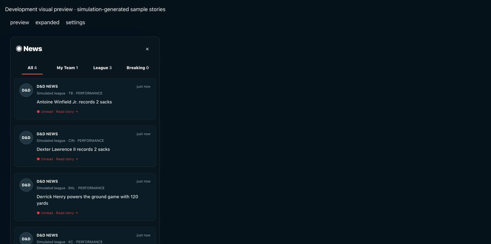
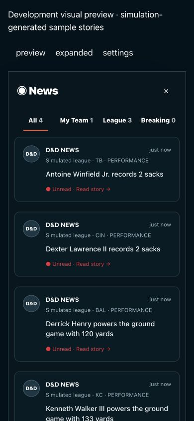
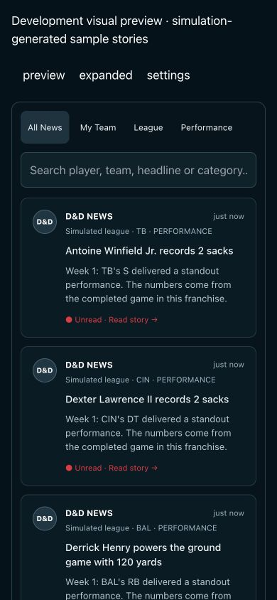

# Front Office News redesign and generation fix

## What changed

- Weekly advancement now selects state-backed player performances, team trends, coaching analysis, eligible expiring-veteran market analysis, and playoff races. All games receive simulated player statistics; ordinary game-result recaps stay out of News.
- Transactions are retained independently of editorial story limits. Release, sign, extension and accepted trade endpoints reconcile committed actions into persisted news and return those events to notification renderers. Multi-player trades group into one story.
- Simulation and News writes share the database transaction. Stable event IDs and conflict handling prevent duplicate records on retries. Corrected double-encoded event metadata and normalized older metadata on reads/filtering.
- Single-week progression refreshes the bell. Badge reflects actual unread stories, capped visually at 99+. Opening the preview does not mark stories read.
- Compact social cards, four preview tabs, 10-story preview, searchable/paginated expanded feed, individual/all-read actions, and persisted per-franchise device toast preferences.
- One grouped toast per batch, individual major-action toast, eight-second dismissal with hover/focus interaction pause. Old parallel transaction tweet popups are suppressed in Front Office.
- Shared presentation/filter/preferences logic used by web and native React Native screens.

## Database regression

Disposable local user and two isolated test franchises; removed automatically after the run. Production simulator advanced one week at a time, with no News UI opened. Events were written through the production event repository alongside the simulation snapshot, then queried through the production feed/count/read functions.

| Completed week | League | My Team | Accumulated unread |
| --- | --- | --- | --- |
| 1 | 3 | 1 | 4 |
| 2 | 2 | 1 | 7 |
| 3 | 3 | 1 | 11 |
| 4 | 2 | 0 | 13 |
| 5 | 3 | 1 | 17 |
| 6 | 2 | 1 | 20 |
| 7 | 3 | 1 | 24 |
| 8 | 2 | 0 | 26 |
| 9 | 7 | 1 | 34 |
| 10 | 3 | 0 | 37 |
| 11 | 2 | 1 | 40 |
| 12 | 3 | 0 | 43 |
| 13 | 2 | 1 | 46 |
| 14 | 3 | 0 | 49 |
| 15 | 2 | 1 | 52 |
| 16 | 3 | 0 | 55 |
| 17 | 2 | 1 | 58 |

Result: **47 league + 11 team = 58 persisted unread stories**, Breaking 0. Week 9 generated eight stories including the team item. Category mix varies with seeded selection; targeted market tests verify eligible rumor coverage using actual fixture roster state.

Additional database checks passed: repeated inserts create no duplicates; opening a 10-story preview leaves unread unchanged; pagination has no overlap; Chiefs name search resolves the team; individual read decrements one; read-all clears unread; a second franchise stays empty; clearing test events returns counts to zero. Targeted committed release, signing and trade events each create exactly one record, appear in My Team, increment unread once and deduplicate on retry. Major trade metadata produces Breaking 1.

## Validation and limits

- Web and native TypeScript checks pass.
- Simulation/event/filter tests cover season progression, deterministic generation, no generation on unchanged state, retained actions, injuries/returns, starter changes, offseason contract/draft context, toast preferences and eligible trade rumors.
- Desktop and 390px mobile-web social-card/expanded-feed rendering checked in a development-only visual preview with simulation-generated data. Fixed cards shrinking inside the scroll area and four-tab wrapping.
- Screenshots are preview rendering checks, not an authenticated browser workflow. The available browser was logged out; full click-through validation in an authenticated franchise remains unverified.
- Native implementation is updated and typechecked, but was not run on an iOS/Android device or simulator.
- News does not invent injuries, transactions, coaching changes or scouting results. Those categories require actual state changes. Advancing existing saves generates future stories; opening News does not backfill past weeks.
- Preferences persist per franchise on the current device; they do not sync between devices.

## Preview screenshots

